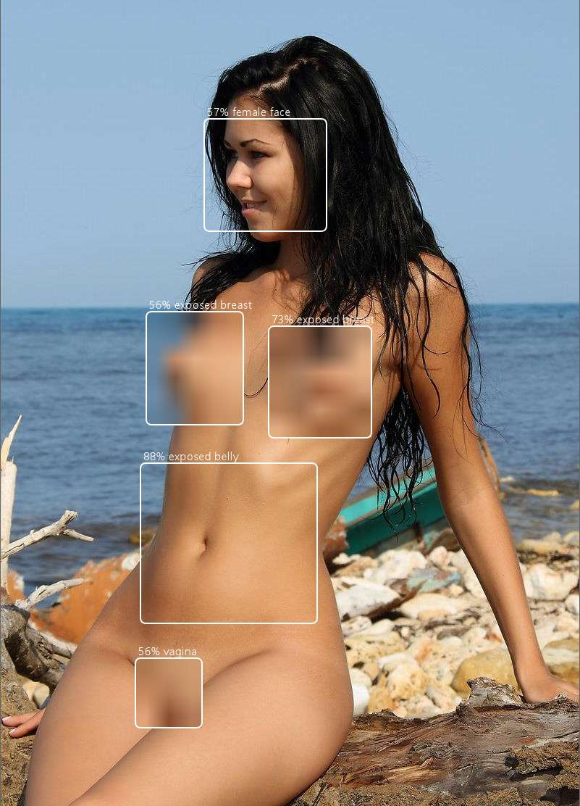

# NudeNet: NSFW Object Detection for TFJS and NodeJS

## Notes

- Models included in `/models/` were converted to **TFJS Graph model** format from the original repository  
  Model descriptors and signature have been additionally parsed for readability  
- Models includ both **default** and **base** variations  
  Note that classes list are different for each variation  
- Models use dynamic input sizes  
- Results parsing implementation does not follow original  
  and is implemented using native TFJS ops and optimized for JavaScript execution  
- Code also includes simple bluring function for exposed body parts in the input image  
- Example implementation for **NodeJS**: `src/nudenet.js`  
- Example implementation for **Browsers**: `src/index.ts`  

<br>

## Output

Structure of the return object:

```js
{
  input: {
    file: String,
    width: Number,
    height: Number,
  },
  person: Boolean, // is person detected?
  sexy: Boolean, // is person considered sexy?
  nude: Boolean, // is person considered nude?
  parts: Array<{ // array of detected body parts
    score: Number, // confidence in detection
    id: Number,
    class: String, // label for body part
    box: Number[], // [x, y, width, height]
  }>,
}
```

Where class can be :

```js
  classes: { // classes labels
    base: [ // base model variation
      'exposed belly',
      'exposed buttocks',
      'exposed breasts',
      'exposed vagina',
      'exposed penis',
      'male breast',
    ],
    default: [ // default model variation
      'exposed anus',
      'exposed armpits',
      'belly',
      'exposed belly',
      'buttocks',
      'exposed buttocks',
      'female face',
      'male face',
      'feet',
      'exposed feet',
      'breast',
      'exposed breast',
      'vagina',
      'exposed vagina',
      'male breast',
      'exposed penis',
    ],
  },
```

<br>

## Example



There are three examples:

- NodeJS Image processing: `src/nudenet.js`  
- NodeJS Video processing: `src/node-video.js`  
  this demo has additional dependencies which are not installed by default  
  `@tensorflow/tfjs-node-gpu` and `pipe2jpeg`  
  and requires functional copy of `ffmpeg`  
- Browser: `src/index.html`  
  written in TypeScript `src/index.ts` and transpiled to JavaScript `dist/index.js`  

<br>

> node src/nudenet.js -i samples/nude.jpg -o samples/nude-out.jpg

```js
2021-10-20 11:11:11 INFO:  nudenet version 0.0.1
2021-10-20 11:11:11 INFO:  User: vlado Platform: linux Arch: x64 Node: v16.8.0
2021-10-20 11:11:11 INFO:  tfjs version: 3.9.0 backend: tensorflow
2021-10-20 11:11:11 INFO:  options: { debug: true, modelPath: 'file://model/model.json', minScore: 0.3, maxResults: 50, iouThreshold: 0.5, outputNodes: [ 'output1', 'output2', 'output3' ], blurNude: true, blurRadius: 25 }
2021-10-20 11:11:11 STATE: loaded graph model: file://model/model.json
2021-10-20 11:11:11 INFO:  loaded image: samples/nude.jpg width: 801 height: 1112
2021-10-20 11:11:13 DATA:  result: {
  input: { file: 'samples/nude.jpg', width: 801, height: 1112 },
  person: true,
  sexy: true,
  nude: true,
  parts: [
    { score: 0.8839950561523438, id: 3, class: 'exposed belly', box: [ 194, 639, 244, 221 ] },
    { score: 0.7332422137260437, id: 11, class: 'exposed breast', box: [ 371, 450, 142, 154 ] },
    { score: 0.566450834274292, id: 6, class: 'female face', box: [ 282, 164, 169, 155 ] },
    { score: 0.5646520256996155, id: 11, class: 'exposed breast', box: [ 202, 430, 134, 156 ] },
    { score: 0.5579367876052856, id: 12, class: 'vagina', box: [ 187, 908, 92, 96 ] }
  ]
}
2021-10-20 11:11:13 STATE: created output image: samples/nude-out.jpg
2021-10-20 11:11:13 STATE: done: model:file://model/model.json input:samples/nude.jpg output:samples/nude-out.jpg objects: 5
```

<br>

## Credits

- Original implementation: <https://github.com/notAI-tech/NudeNet>
- Model checkpoints: <https://github.com/notAI-tech/NudeNet/releases/tag/v0>
